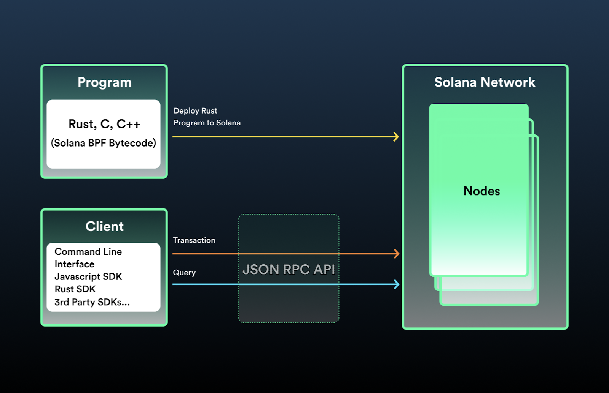
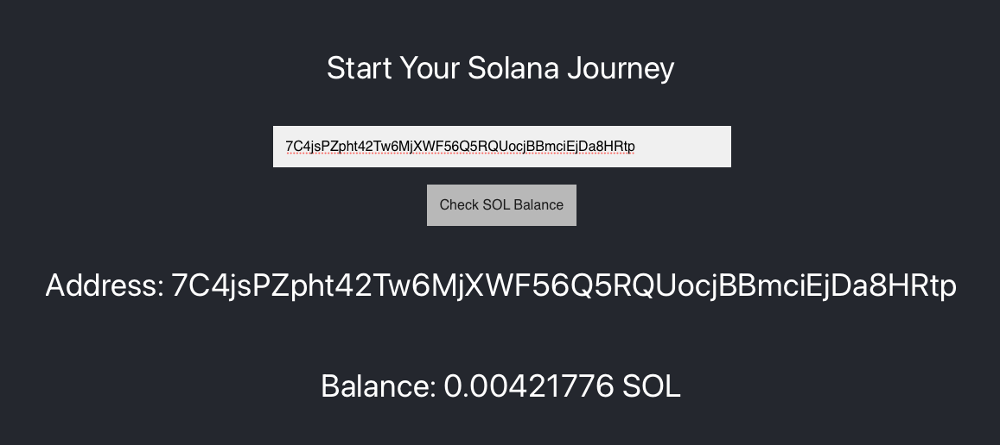
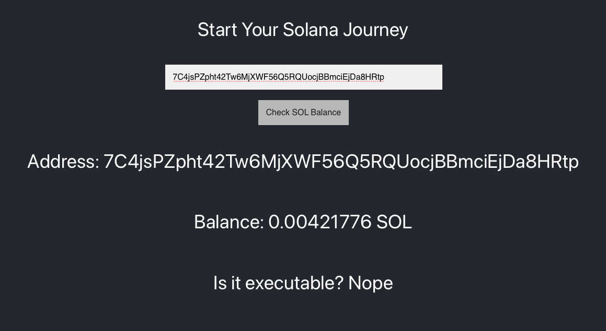

# （读取数据从solana network）Read Data From The Solana Network

## TL;DR

- 账户就像Solana网络分类帐中的文件一样。所有状态数据都存储在一个账户中。账户可以用于许多事情，但现在我们将关注存储SOL的账户方面。

- SOL是Solana本机代币的名称。

- Lamports是小数点后的SOL，以[Leslie Lamport](https://en.wikipedia.org/wiki/Leslie_Lamport)命名。

- 公钥，通常称为地址，指向Solana网络上的账户。虽然您必须拥有特定的秘密密钥才能在账户内执行某些功能，但任何人都可以使用公钥读取账户数据。

- JSON RPC API：所有与Solana网络的交互都通过[JSON RPC API](https://docs.solana.com/developing/clients/jsonrpc-api)进行。这实际上是一个带有JSON正文的HTTP POST，表示您要调用的方法。

- @solana/web3.js是JSON RPC API上的抽象层。它可以通过npm安装，并允许您将Solana方法作为JavaScript函数调用。例如，您可以使用它查询任何账户的SOL余额：

```js
  async function getBalanceUsingWeb3(address: PublicKey): Promise<number> {
    const connection = new Connection(clusterApiUrl('devnet'));
    return connection.getBalance(address);
}

const publicKey = new PublicKey('7C4jsPZpht42Tw6MjXWF56Q5RQUocjBBmciEjDa8HRtp')
getBalanceUsingWeb3(publicKey).then(balance => {
    console.log(balance)
})
```

## Overview

### 账户

Solana账户类似于操作系统（如Linux）中的文件。它们持有任意的、持久的数据，并且足够灵活，可以用于许多不同的方式。

在这个教程中，我们不会过多考虑账户，只关注它们存储SOL（Solana的原生代币——稍后会讲到）的能力。但是，账户还可用于存储可作为程序运行的自定义数据结构和可执行代码。账户将涉及你在Solana上所做的所有事情。

#### 公钥

公钥通常被称为地址。这些地址指向Solana网络上的账户。如果你想运行特定的程序或转移SOL，你需要提供必要的公钥（或密钥）。

公钥是256位的，通常表示为base-58编码的字符串，如7C4jsPZpht42Tw6MjXWF56Q5RQUocjBBmciEjDa8HRtp。

### The Solana JSON RPC API



所有与Solana网络的客户端交互都是通过Solana的[JSON RPC API](https://docs.solana.com/developing/clients/jsonrpc-api)进行的。

根据[JSON-RPC 2.0](https://www.jsonrpc.org/specification)规范，

> JSON-RPC是一种无状态的轻量级远程过程调用（RPC）协议。主要规定了几种数据结构及其处理规则。它是传输不可知的，因为这些概念可以在同一进程中、通过套接字、通过http或在许多不同的消息传递环境中使用。它使用[JSON](https://www.json.org/json-en.html)（[RFC 4627](https://www.ietf.org/rfc/rfc4627.txt)）作为数据格式。

实际上，这个规范简单地涉及发送一个表示要调用的方法的JSON对象。您可以使用套接字、http等方式进行此操作。

这个JSON对象需要四个成员:

- jsonrpc - JSON RPC版本号。这必须是精确地“2.0”。
- id - 用于标识调用的标识符。这可以是一个字符串或一个整数。
- method - 您要调用的方法的名称。
- params - 包含在方法调用期间使用的参数的数组。


因此，如果您想在Solana网络上调用getBalance方法，您可以向Solana集群发送HTTP调用，如下所示:

```js
async function getBalanceUsingJSONRPC(address: string): Promise<number> {
    const url = clusterApiUrl('devnet')
    console.log(url);
    return fetch(url, {
        method: 'POST',
        headers: { 'Content-Type': 'application/json' },
        body: JSON.stringify({
            "jsonrpc": "2.0",
            "id": 1,
            "method": "getBalance",
            "params": [
                address
            ]
        })
    }).then(response => response.json())
    .then(json => {
        if (json.error) {
            throw json.error
        }

        return json['result']['value'] as number;
    })
    .catch(error => {
        throw error
    })
}
```

### Solana’s Web3.js SDK

虽然JSON-RPC API足够简单，但它涉及大量枯燥的样板文件。为了简化通信过程，Solana Labs创建了@solana/web3.js SDK，作为JSON-RPC API的一个抽象。

Web3.js允许您使用JavaScript函数调用JSON-RPC API方法。该SDK提供了一套助手函数和对象。我们将逐步介绍SDK的大部分内容，但不会深入介绍所有内容，因此请务必在某个时候查看[文档](https://docs.solana.com/developing/clients/javascript-reference)。

#### 安装

在整个课程中，我们大多数时候会使用npm。如何使用npm不在本课程的范围内，我们将假设它是您经常使用的工具。如果不是，请[查看此链接](https://nodesource.com/blog/an-absolute-beginners-guide-to-using-npm/)。

要安装@solana/web3.js，请按照您通常的项目设置方式操作，然后使用以下命令：

```bash
npm install @solana/web3.js.
```

#### 连接网络

使用@solana/web3.js与Solana网络的每个交互都将通过Connection对象进行。该对象与Solana集群建立JSON-RPC连接（稍后会讨论集群）。现在，我们将使用Devnet集群的URL而不是Mainnet。正如名称所示，此集群是为开发人员使用和测试而设计的。

```js
const connection = new Connection(clusterApiUrl('devnet'));
```

#### 从网络中读取

一旦你拥有了 Connection 对象，查询网络就像调用适当的方法一样简单。例如，要获取特定地址的余额，你需要执行以下操作：

```js
async function getBalanceUsingWeb3(address: PublicKey): Promise<number> {
    const connection = new Connection(clusterApiUrl('devnet'));
    return connection.getBalance(address);
}
```

返回的余额以名为 lamports 的分数 SOL 形式返回。一个 lamport 表示 0.000000001 SOL。大多数情况下，当涉及到 SOL 时，系统会使用 lamports 而不是 SOL。Web3.js 提供了常量 LAMPORTS_PER_SOL 以进行快速转换。

... 就这样，现在您知道如何从 Solana 区块链中读取数据了！一旦涉及到自定义数据，情况就会变得更加复杂。但现在，让我们练习一下我们到目前为止所学的内容。

### 演示

让我们创建一个简单的网站，让用户检查特定地址的余额。

它的外观将类似于这样：



为了保持话题的连贯性，我们不会从头开始开发项目。您可以在此处找到起始代码。起始项目使用了Next.js和Typescript。如果您习惯使用不同的技术栈，不用担心！您在这些课程中学到的web3和Solana原则适用于您最熟悉的任何前端技术栈。

#### 1. Get oriented

下载并打开starter code，使用npm install安装依赖项，然后使用npm run dev运行该应用。请注意，无论您将什么内容输入到地址字段中，当您单击“Check SOL Balance”按钮时，余额将是1000的占位符值。
应用由index.tsx和AddressForm.tsx组成。当用户提交表单时，将调用index.tsx中的addressSubmittedHandler函数。这是我们将添加更新其余UI的逻辑的地方。

#### 2.安装依赖

使用npm install @solana/web3.js安装Solana Web3库的依赖。

#### 3. 设置地址余额


首先，在index.tsx顶部导入@solana/web3.js库。

现在，让我们进入addressSubmittedHandler并创建一个PublicKey实例，使用表单输入的地址值。接下来，创建一个Connection实例，并使用它调用getBalance方法。传入刚刚创建的公钥的值。最后，调用setBalance，将getBalance的结果传入其中。如果您有信心，请尝试独立完成此操作，而不是从下面的代码段复制。

```js
import type { NextPage } from 'next'
import { useState } from 'react'
import styles from '../styles/Home.module.css'
import AddressForm from '../components/AddressForm'
import * as Web3 from '@solana/web3.js'

const Home: NextPage = () => {
  const [balance, setBalance] = useState(0)
  const [address, setAddress] = useState('')

  const addressSubmittedHandler = (address: string) => {
    setAddress(address)
    const key = new Web3.PublicKey(address)
    const connection = new Web3.Connection(Web3.clusterApiUrl('devnet'))
    connection.getBalance(key).then(balance => {
      setBalance(balance / Web3.LAMPORTS_PER_SOL)
    })
  }

...

}
```

请注意，我们将 Solana 返回的余额除以 LAMPORTS_PER_SOL。Lamports 是分数 SOL（0.000000001 SOL）。大多数情况下，在处理 SOL 时，系统将使用 lamports 而不是 SOL。在这种情况下，网络返回的余额是以 lamports 表示的。在将其设置为我们的状态之前，我们使用 LAMPORTS_PER_SOL 常量将其转换为 SOL。

此时，您应该能够在表单字段中输入有效地址，然后单击“Check SOL Balance”以查看下面的地址和余额。

#### 4. Handle invalid addresses

我们快完成了，剩下的唯一问题是使用无效地址不会显示任何错误消息或更改显示的余额。如果打开开发人员控制台，您会看到错误：无效的公钥输入。在使用PublicKey构造函数时，您需要传入有效的地址，否则将收到此错误。

要解决这个问题，让我们将所有内容包装在try-catch块中，如果用户输入无效，就会弹出警报。

请注意，在catch块中我们还清空了地址和余额以避免混淆。

我们做到了！我们拥有一个可以从Solana网络读取SOL余额的运作正常的网站。你已经在走向实现在Solana上的伟大愿望的道路上了。如果你需要花更多的时间来仔细研究这段代码，可以查看完整的[解决方案代码](https://github.com/Unboxed-Software/solana-intro-frontend)。请紧紧抓住，这些课程将迅速升级。

### Challenge

由于这是第一个挑战，我们将保持简单。请继续在我们已经创建的前端上进行添加，在“余额”后添加一行项目。使该行项目显示该账户是否为可执行账户。提示：可以使用 getAccountInfo 方法。

您的标准钱包地址不会是可执行的，因此如果您想要一个可用于测试的可执行地址，请使用 CenYq6bDRB7p73EjsPEpiYN7uveyPUTdXkDkgUduboaN。



如果你卡住了，可以看一下[答案代码](https://github.com/Unboxed-Software/solana-intro-frontend/tree/challenge-solution)。