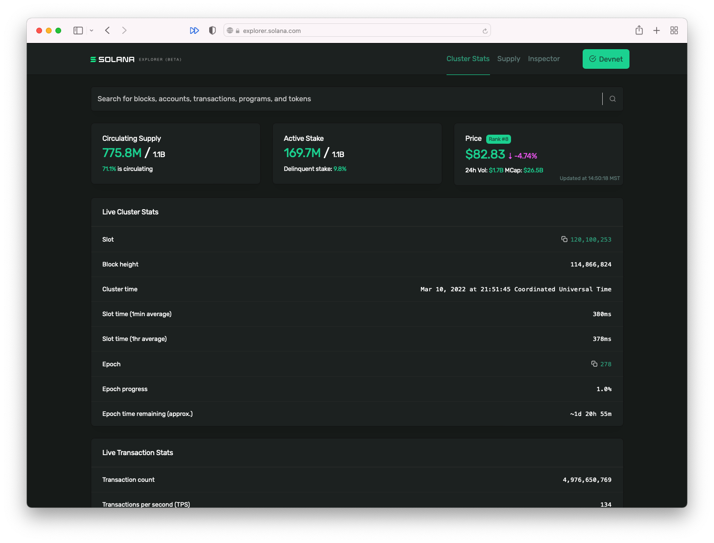
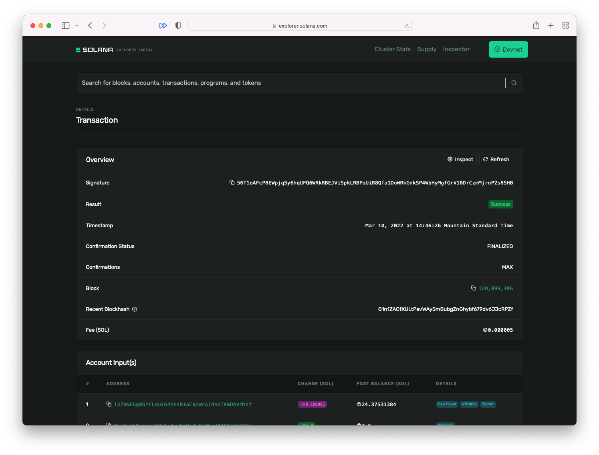
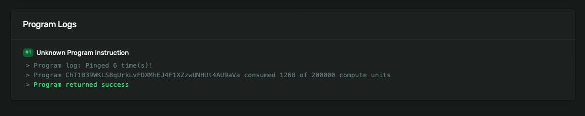

# Write Data To The Solana Network

## TL;DR

- **Keypair**（密钥对）是公钥和私钥的配对。公钥被用作指向 Solana 网络上某个账户的“地址”。私钥用于验证身份或授权。正如其名称所示，您应该始终将私钥保持私有。@solana/web3.js 提供了用于创建全新密钥对的辅助函数，或使用现有的私钥构建密钥对的函数。

- **交易**是一组指令的有效集合，用于调用 Solana 程序。每个交易的结果取决于所调用的程序。对链上数据的所有修改都通过交易进行。例如：

```js
const transaction = new Transaction()

const sendSolInstruction = SystemProgram.transfer({
    fromPubkey: sender,
    toPubkey: recipient,
    lamports: LAMPORTS_PER_SOL * amount
})

transaction.add(sendSolInstruction)

const signature = sendAndConfirmTransaction(
    connection,
    transaction,
    [senderKeypair]
)
```

## Overview

### Keypair

如其名称所示，Keypair 是一对密钥：公钥和私钥。

- 公钥用作指向 Solana 网络上某个账户的“地址”。
- 私钥用于验证身份或授权。正如其名称所示，您应始终将私钥保持私有。

在 Solana 网络中，绝大多数的交互操作都需要使用 Keypair。如果您还没有 Keypair，或者想为特定目的生成一个新的 Keypair，@solana/web3.js 提供了一个用于创建全新密钥对的辅助函数。

```js
const ownerKeypair = Keypair.generate()
```

Keypair 是一种数据类型，可以将其分解为公钥。

```js
const publicKey = ownerKeypair.publicKey
```

或者可以将其分解为私钥。

```js
const secretKey = ownerKeypair.secretKey
```

如果您已经有一个要使用的 Keypair，则可以使用 Keypair.fromSecretKey() 函数从私钥创建 Keypair。为确保您的私钥安全，请通过环境变量注入私钥，并不要提交您的 .env 文件。

```js
const secret = JSON.parse(process.env.PRIVATE_KEY ?? "") as number[]
const secretKey = Uint8Array.from(secret)
const keypairFromSecretKey = Keypair.fromSecretKey(secretKey)
```

### Transactions

任何对链上数据的修改都是通过发送给程序的交易进行的。

交易指令包括：

- 您要调用的程序的标识符
- 将被读取和/或写入的账户数组
- 按程序被调用指定的以字节数组结构化的数据


当您向 Solana 集群发送交易时，Solana 程序将使用交易中包含的指令被调用。

正如您所期望的那样，@solana/web3.js 提供了用于创建交易和指令的辅助函数。您可以使用构造函数 new Transaction() 创建一个新的交易。一旦创建，您可以使用 add() 方法向交易添加指令。

当使用自定义程序时，指令可能会变得复杂。幸运的是，@solana/web3.js 提供了一些便利函数，用于一些 Solana 的本机程序和基本操作，如转移 SOL。

```js
const transaction = new Transaction()

const sendSolInstruction = SystemProgram.transfer({
    fromPubkey: sender,
    toPubkey: recipient,
    lamports: LAMPORTS_PER_SOL * amount
})

transaction.add(sendSolInstruction)
```

SystemProgram.transfer() 函数需要以下参数：

- 与发送方账户相对应的公钥
- 与接收方账户相对应的公钥
- 以 lamports 为单位的要发送的 SOL 数量

然后，该函数返回将 SOL 从发送方发送到接收方的指令，之后可以将该指令添加到交易中。

创建交易后，需要将其发送到集群并进行确认：

```js
const signature = sendAndConfirmTransaction(
    connection,
    transaction,
    [senderKeypair]
)
```

sendAndConfirmTransaction() 函数需要以下参数：

- 集群连接
- 交易
- 将作为交易签名者的 Keypair 数组。在本示例中，我们只有一个签名者：发送方。

#### Instructions

发送 SOL 的示例非常适合介绍如何发送交易，但很多 web3 开发将涉及调用非本机程序。在上面的示例中，SystemProgram.transfer() 函数确保您传递了创建指令所需的所有必要数据，然后为您创建指令。然而，当使用非本机程序时，您需要非常明确地创建结构化以匹配相应程序的指令。

使用 @solana/web3.js，您可以使用 TransactionInstruction 构造函数创建非本机指令。该构造函数采用一个单一的 TransactionInstructionCtorFields 数据类型参数。

```js
export type TransactionInstructionCtorFields = {
  keys: Array<AccountMeta>;
  programId: PublicKey;
  data?: Buffer;
};
```

根据上述定义，传递给 TransactionInstruction 构造函数的对象需要：

- 类型为 AccountMeta 的密钥数组
- 被调用的程序的公钥
- 可选的缓冲区，包含要传递给程序的数据。

我们现在将忽略数据字段，并在未来的课程中重新讨论它。

programId 字段相当明显：它是与程序关联的公钥。在调用程序之前，您需要预先知道这个公钥，就像您需要知道要发送 SOL 的接收方的公钥一样。

keys 数组需要更多的解释。该数组中的每个对象表示在交易执行期间将从中读取或写入的帐户。这意味着您需要了解调用的程序的行为，并确保在数组中提供所有必要的帐户。

keys 数组中的每个对象必须包括以下内容：

- pubkey - 帐户的公钥
- isSigner - 表示该帐户是否是交易的签名者的布尔值
- isWritable - 表示在交易执行期间是否写入该帐户的布尔值

将所有这些组合在一起，我们可能会得到以下内容：

```js

async function callProgram(
    connection: web3.Connection,
    payer: web3.Keypair,
    programId: web3.PublicKey,
    programDataAccount: web3.PublicKey
) {
    const instruction = new web3.TransactionInstruction({
        keys: [
            {
                pubkey: programDataAccount,
                isSigner: false,
                isWritable: true
            },
        ],
        programId
    })

    const signature = await web3.sendAndConfirmTransaction(
        connection,
        new web3.Transaction().add(instruction),
        [payer]
    )

    console.log(signature)
}
```

#### Transaction Fees

交易费用内置在 Solana 经济中，作为补偿验证者网络处理交易所需的 CPU 和 GPU 资源。与许多网络不同，这些网络有一个费用市场，用户可以支付更高的费用来增加被包含在下一个块中的机会，Solana 交易费用是确定性的。

交易签名者数组中包含的第一个签名者负责支付交易费用。如果该签名者的帐户中没有足够的 SOL 来支付交易费用，则交易将被丢弃。

在测试时，无论是本地还是在 devnet 上，您都可以使用 Solana CLI 命令 solana airdrop 1 在您的帐户中获取免费的测试 SOL，以支付交易费用。

#### Solana Explorer



区块链上的所有交易都可以在 Solana Explorer 上公开查看。例如，您可以在上面的示例中使用 sendAndConfirmTransaction() 返回的签名，在 Solana Explorer 中搜索该签名，然后查看：

- 交易发生的时间
- 它所在的块
- 交易费用
- 以及更多信息！



## Demo

我们将创建一个脚本来 ping 一个简单的程序，每次 ping 时它会增加一个计数器。这个程序存在于 Solana Devnet 上的地址 ChT1B39WKLS8qUrkLvFDXMhEJ4F1XZzwUNHUt4AU9aVa。程序将计数数据存储在特定的帐户地址 Ah9K7dQ8EHaZqcAsgBW8w37yN2eAy3koFmUn4x3CJtod 中。

### 1. Basic scaffolding

让我们从一些基本的脚手架开始。您可以根据自己的需求设置项目，但我们将使用一个简单的 Typescript 项目，其中包含 @solana/web3.js 包的依赖项。如果您想使用我们的脚手架，可以在命令行中使用以下命令：

```bash
mkdir -p solana-ping-client/src && \
	cd solana-ping-client && \
	touch src/index.ts && \
	git init && touch .gitignore && \
	npm init -y && \
	npm install --save-dev typescript && \
  npm install --save-dev ts-node && \
	npx tsc --init && \
	npm install @solana/web3.js && \
	npm install dotenv && \
	touch .env
```

这将：

1. 创建一个新的项目目录，其中包含一个名为 src 的子目录
2. 将命令行提示符移动到项目目录内
3. 在 src 中创建一个名为 index.ts 的文件
4. 使用 .gitignore 文件初始化 git 存储库
5. 创建一个新的 npm 包
6. 添加 typescript 开发人员依赖项
7. 添加 ts-node 开发人员依赖项
8. 创建一个 .tsconfig 文件
9. 安装 @solana/web3.js 依赖项
10. 安装 .dotenv 依赖项
11. 创建一个 .env 文件

如果您想完全匹配我们的代码，请将 tsconfig.json 的内容替换为以下内容：

```json
{
  "compilerOptions": {
    "target": "es5",
    "module": "commonjs",
    "strict": true,
    "esModuleInterop": true,
    "skipLibCheck": true,
    "forceConsistentCasingInFileNames": true,
    "outDir": "dist"
  },
  "include": [ "./src/**/*" ]
}
```

将以下内容添加到 .gitignore 文件中：

```bash
node_modules/
dist/
.env
```

最后，在 package.json 文件的 scripts 对象中添加以下内容：

```json
"start": "ts-node src/index.ts"
```

### 2. Generate a new keypair

在执行任何操作之前，您需要一个密钥对。让我们进入 index.ts 文件并生成一个：

```js
import web3 = require('@solana/web3.js')
import Dotenv from 'dotenv'
Dotenv.config()

async function main() {
    const newKeypair = web3.Keypair.generate()
    console.log(newKeypair.secretKey.toString())
}

main().then(() => {
    console.log("Finished successfully")
}).catch((error) => {
    console.error(error)
})
```

大部分的代码都是为了正确运行文件所需的模板代码。main() 函数内的代码生成一个新的密钥对，并将私钥记录在控制台中。

在保存此文件后运行 npm start，应该会在控制台上打印出一个数字数组。该数组表示您的新密钥对的私钥。请勿在 Mainnet 上使用此密钥对。仅在测试中使用此密钥对。

从控制台日志中复制密钥数组，并将其作为名为 PRIVATE_KEY 的环境变量粘贴到 .env 文件中。这样，我们可以在将来的开发中重复使用此密钥对，而不是每次运行某个命令时都生成一个新的密钥对。它应该看起来像这样，但数字可能不同：

```js
PRIVATE_KEY=[56,83,31,62,66,154,33,74,106,59,111,224,176,237,89,224,10,220,28,222,128,36,138,89,30,252,100,209,206,155,154,65,98,194,97,182,98,162,107,238,61,183,163,215,44,6,10,49,218,156,5,131,125,253,247,190,181,196,0,249,40,149,119,246]
```

### 3. Initialize Keypair from secret

现在我们已经成功生成了一个密钥对并将其复制到了.env文件中，我们可以删除main()函数中的代码。

现在，让我们在main()函数外创建一个名为initializeKeypair()的新函数。在这个新函数内：

1. 将PRIVATE_KEY环境变量解析为number[]
2. 使用它来初始化一个Uint8Array
3. 使用该Uint8Array初始化并返回一个Keypair。

```js
function initializeKeypair(): web3.Keypair {
    const secret = JSON.parse(process.env.PRIVATE_KEY ?? "") as number[]
    const secretKey = Uint8Array.from(secret)
    const keypairFromSecretKey = web3.Keypair.fromSecretKey(secretKey)
    return keypairFromSecretKey
}
```

### 4. Ping program

现在我们有了初始化密钥对的方法，我们需要建立与 Solana Devnet 的连接。在 main() 函数中，让我们调用 initializeKeypair() 方法并创建一个连接：

```js
async function main() {
    const payer = initializeKeypair()
    const connection = new web3.Connection(web3.clusterApiUrl('devnet'))
}
```

现在创建一个异步函数 pingProgram()，在 main() 函数外部，它需要两个参数：连接和付款者的密钥对作为参数:

```js
async function pingProgram(connection: web3.Connection, payer: web3.Keypair) { }
```

在这个函数中，我们需要：

- 创建一个事务
- 创建一个指令
- 将指令添加到事务
- 发送事务。

记住，这里最具挑战性的部分是在指令中包含正确的信息。我们知道我们要调用的程序的地址。我们还知道该程序会将数据写入另一个帐户，其地址我们也有。让我们在index.ts文件的顶部添加两者的字符串版本作为常量：

```js
const PROGRAM_ADDRESS = 'ChT1B39WKLS8qUrkLvFDXMhEJ4F1XZzwUNHUt4AU9aVa'
const PROGRAM_DATA_ADDRESS = 'Ah9K7dQ8EHaZqcAsgBW8w37yN2eAy3koFmUn4x3CJtod'
```

现在，在pingProgram()函数中，让我们创建一个新的交易，然后初始化一个程序账户的公钥，以及另一个数据账户的公钥。

```js
async function pingProgram(connection: web3.Connection, payer: web3.Keypair) {
    const transaction = new web3.Transaction()

    const programId = new web3.PublicKey(PROGRAM_ADDRESS)
    const programDataPubkey = new web3.PublicKey(PROGRAM_DATA_ADDRESS)
}
```

接下来，让我们创建指令。记住，指令需要包括程序的公共密钥，它还需要包括一个包含所有将被读取或写入的账户的数组。在这个示例程序中，只需要引用上面提到的数据帐户。

```js
async function pingProgram(connection: web3.Connection, payer: web3.Keypair) {
    const transaction = new web3.Transaction()

    const programId = new web3.PublicKey(PROGRAM_ADDRESS)
    const programDataPubkey = new web3.PublicKey(PROGRAM_DATA_ADDRESS)

    const instruction = new web3.TransactionInstruction({
        keys: [
            {
                pubkey: programDataPubkey,
                isSigner: false,
                isWritable: true
            },
        ],
        programId
    })
}
```

接下来，我们将创建的指令添加到函数开头创建的事务中。然后，通过传递连接、事务和付款人，调用 sendAndConfirmTransaction()。最后，我们将记录该函数调用的结果，以便我们可以在 Solana Explorer 上查找。

以下是完整的pingProgram()函数代码：

```js

async function pingProgram(connection: web3.Connection, payer: web3.Keypair) {
    const transaction = new web3.Transaction()

    const programId = new web3.PublicKey(PROGRAM_ADDRESS)
    const programDataPubkey = new web3.PublicKey(PROGRAM_DATA_ADDRESS)

    const instruction = new web3.TransactionInstruction({
        keys: [
            {
                pubkey: programDataPubkey,
                isSigner: false,
                isWritable: true
            },
        ],
        programId
    })

    transaction.add(instruction)

    const signature = await web3.sendAndConfirmTransaction(
        connection,
        transaction,
        [payer]
    )

    console.log(signature)
}
```

在main()函数内，使用connection和payer调用pingProgram()：

```js
async function main() {
    const payer = initializeKeypair()
    const connection = new web3.Connection(web3.clusterApiUrl('devnet'))
    await pingProgram(connection, payer)
}
```

### 5. Airdrop

现在运行npm start看看是否可以运行。你可能会在控制台中看到以下错误：

> Transaction simulation failed: Attempt to debit an account but found no record of a prior credit.

如果遇到此错误，那是因为你的密钥对是全新的，没有任何 SOL 来支付交易费用。我们可以在pingProgram()调用之前在main()函数中添加以下行来解决这个问题：

```js
await connection.requestAirdrop(payer.publicKey, web3.LAMPORTS_PER_SOL*1)
```

这将向您的帐户中存入1个 SOL，您可以用于测试。这在主网上是无效的，因为实际上这会具有价值。但是这对于在本地和 Devnet 上进行测试非常方便。

### 6. Check the Solana explorer

现在再次运行代码。可能需要一两分钟的时间，但是现在代码应该能够正常工作，您应该会看到打印在控制台上的一个长字符串，如下所示：

```js
55S47uwMJprFMLhRSewkoUuzUs5V6BpNfRx21MpngRUQG3AswCzCSxvQmS3WEPWDJM7bhHm3bYBrqRshj672cUSG
```

请注意，您正在与一名AI进行交互，交互语言为英文。以下是您需要的翻译：

请复制此确认签名。在浏览器中打开 [https://explorer.solana.com/?cluster=devnet](https://explorer.solana.com/?cluster=devnet)（URL末尾的查询参数确保您浏览的是Devnet上的交易，而不是Mainnet）。将签名粘贴到Solana的Devnet资源管理器顶部的搜索栏中，然后按Enter键。您应该会看到有关交易的所有详细信息。如果您滚动到最底部，则会看到程序日志，其中显示程序已被ping了多少次，包括您的ping。



如果您想在以后更轻松地查看 Solana Explorer 中的交易记录，只需将 pingProgram() 函数中的 console.log 更改为以下内容：

```js
console.log(`You can view your transaction on the Solana Explorer at:\nhttps://explorer.solana.com/tx/${sig}?cluster=devnet`)
```

接下来几个课程，您将学习如何：

- 安全地从浏览器中调用程序，而不是从运行脚本中调用程序
- 将自定义数据添加到您的指令中
- 从链上反序列化数据

## Challenge

请继续从头开始创建一个脚本，以便您可以在Devnet上将SOL从一个账户转移到另一个账户。确保打印出交易签名，以便您可以在Solana Explorer上查看。

如果您遇到问题，请随时查看[解决方案代码](https://github.com/Unboxed-Software/solana-send-sol-client)。

